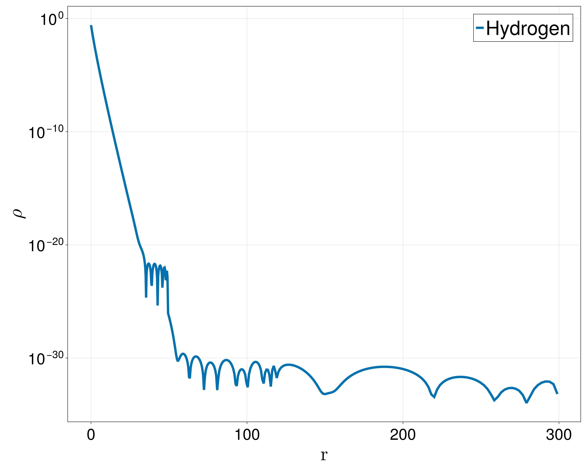

# AtomicKohnSham.jl
<p align="center">

</p>

[](https://github.com/Theozeud/AtomicKohnSham/actions/workflows/CI.yml?query=branch%3Amain)
[](https://codecov.io/gh/Theozeud/AtomicKohnSham)

[](https://github.com/SciML/SciMLStyle)

**AtomicKohnSham.jl** is a Julia package designed to **compute the ground state of isolated atoms and ions** within the framework of **Extended Kohn-Sham models**. Originally developed to investigate the existence of negative ions, the code can also serve as a versatile tool for testing new density functionals and exploring numerical precision issues.

## Installation 

You can install the package via Julia's package manager:
```julia
] add AtomicKohnSham
```
## Overview 

Extended Kohn-Sham models involve solving nonlinear eigenvalue PDEs in 3D, where the Kohn–Sham potential depends on a finite set of eigenfunctions. The standard approach applies a fixed-point (Self-Consistent Field, SCF) iteration, alternating with eigenvalue solves.

Assuming spherical symmetry, the eigenvalue problem can be reduced to a family of radial 1D equations. This package implements a **high-precision finite element method (FEM)** for solving these equations, using **polynomials of degree up to 20** on exponential meshes. This approach allows for highly accurate results with relatively few mesh points, often outperforming low-order methods on refined meshes.

The code supports both **double (Float64)** and **quadruple (Double64)** floating-point precision. This level of precision is crucial for resolving subtle numerical questions that remain open in the literature. For example, in certain Extended Kohn–Sham models, it is still unclear whether the energy of the outermost orbital in some atoms is exactly zero or simply very close to zero but negative—a distinction that this package is designed to investigate numerically.

## Key Features
Currently supported functionalities:

- **SCF Algorithms:** CDA | ODA | Quadratic  
- **Symmetry:** Spherical → radial  
- **FEM Basis:** Integrated Legendre polynomials (order ≤ 20)  
- **Exchange–Correlation:** LDA, LSDA  
- **Mesh Types:** Linear, Geometric, Exponential  
- **Precision:** Float64 (double), Double64 (quadruple)

## Recommendations
Based on our experiments, the following setup provides excellent results:
- Use an exponential mesh with a parameter between 1 and 2.
- Combine it with the Integrated Legendre polynomial basis of order up to 20.
  
This combination offers a good balance between numerical accuracy and computational efficiency.

## Notes :
- Currently, only one FEM basis has been implemented. However, adding a new one is straightforward, as all FEM matrix assemblies are handled automatically


- Higer precision should works but this has not been thoroughly tested.

## Example

Here is one example on the hydrogen atom with the Slater exchange. You can directly create the whole problem with
all parameters.
```julia
problem = AtomProblem(;
                       # MODEL PARAMETERS
                       
                       z = 1,                               # Nuclear Charge
                       N = 1,                               # Number of electrons
                       ex = Functional(:lda_x, n_spin = 1), # Exchange Functional
                       ec = NoFunctional(1),                # Correlation Functional

                       # DISCRETIZATION PARAMETERS
                       lh = 0,                              # Angular momentum cutoff       
                       Nmesh = 10,                          # Number of points of the mesh
                       Rmax = 300,                          # Radial domain cutoff

                       typemesh = expmesh,                  # How the mesh is generated
                       optsmesh = (s = 1.5,),               # Options to this generation

                       typebasis = P1IntLegendreBasis,      # Choice of FEM Basis
                       optsbasis = (ordermax = 10,),        # Polynomials up to order 10.

                       integration_method = GaussLegendre,  # Method for integrals quadrature
                       optsintegration = (npoints = 1000,)  # Options for this method

                       # ALGORITHMS
                       alg = ODA(0.4),                      # SCF alg : Optimal Dampling

                       # SOLVER OPTIONS
                       T = Float64,                         # Data type for computations
                       scftol = 1e-11,                      # SCF Tolerance
                       maxiter = 100,                       # Max number of SCF iterations
                       degen_tol = 1e-2,                    # Tolerance between orbital
                                                            # energies to detect degeneracy
                       verbose = 0)                         # Verbosity level: 
                                                            # 0 = silent, 3 = maximum verbosity
``` 
Additional options are available but have been omitted here for simplicity.

Then, you can find the groundstate :

```julia
sol = groundstate(problem)

julia> sol
Name : Hydrogen
Sucess = SUCCESS
niter = 20
Stopping criteria = 7.588619340831631e-12
All Energies :
            Ekin = 0.40653407924275053 
            Ecou = -0.9000752043172076 
            Ehar = 0.27492250294985154 
            Eexc = -0.1879154570959805 
            Etot = -0.40653407922058604 
Occupation number = 
            1s : (-0.19425006196620562,1.0) 
``` 
The associated density can be plotted with a logarithmic y-axis: 



