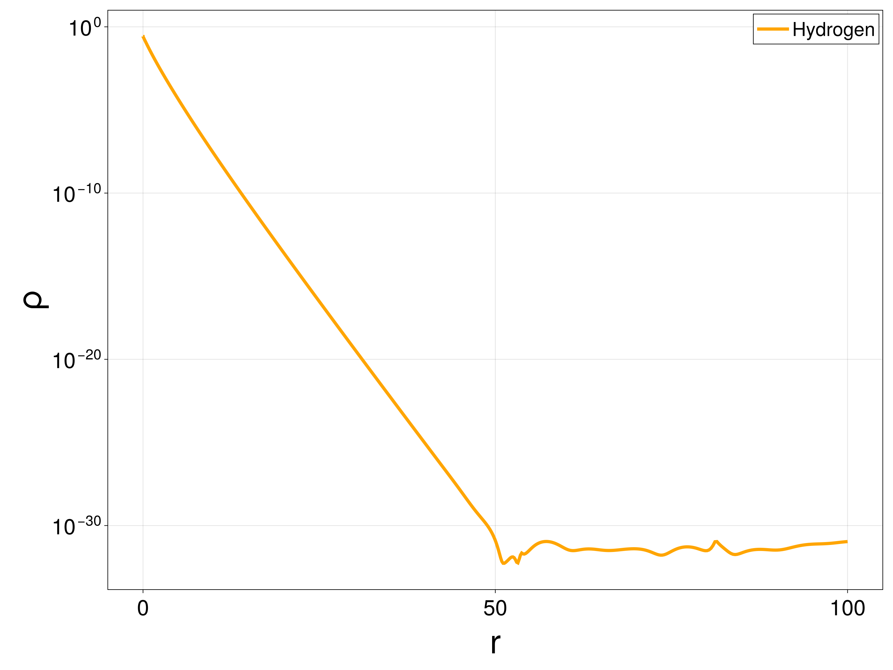

# AtomicKohnSham.jl
<p align="center">

</p>

[](https://github.com/Theozeud/AtomicKohnSham/actions/workflows/CI.yml?query=branch%3Amain)
[](https://codecov.io/gh/Theozeud/AtomicKohnSham)

[](https://github.com/SciML/SciMLStyle)

**AtomicKohnSham.jl** is a Julia package designed to **compute the ground state of isolated atoms and ions** within the framework of **Extended Kohn-Sham models**. Originally developed to investigate the existence of negative ions, the code can also serve as a versatile tool for testing new density functionals and exploring numerical precision issues.

## Installation 

You can install the package via Julia's package manager:
```julia
] add AtomicKohnSham
```
## Overview 

Extended Kohn-Sham models involve solving nonlinear eigenvalue PDEs in 3D, where the Kohn–Sham potential depends on a finite set of eigenfunctions. The standard approach applies a fixed-point (Self-Consistent Field, SCF) iteration, alternating with eigenvalue solves.

Assuming spherical symmetry, the eigenvalue problem can be reduced to a family of radial 1D equations. This package implements a **high-precision finite element method (FEM)** for solving these equations, using **polynomials of degree up to 20** on exponential meshes. This approach allows for highly accurate results with relatively few mesh points, often outperforming low-order methods on refined meshes.

The code supports both **double (Float64)** and **quadruple (Double64)** floating-point precision. This level of precision is crucial for resolving subtle numerical questions that remain open in the literature. For example, in certain Extended Kohn–Sham models, it is still unclear whether the energy of the outermost orbital in some atoms is exactly zero or simply very close to zero but negative—a distinction that this package is designed to investigate numerically.

## Key Features
Currently supported functionalities:

- **SCF Algorithm:** ODA (Optimal Damping Algorithm)
- **Symmetry:** Spherical → radial  
- **FEM Basis:** Integrated Legendre polynomials (order ≤ 20)  
- **Exchange–Correlation:** LDA, LSDA (via [Libxc.jl](https://github.com/unkcpz/Libxc.jl), plus a built-in Slater exchange)
- **Mesh Types:** Linear, Geometric, Polynomial, Exponential, Exp-Lin
- **Precision:** Float64 (double), Double64 (quadruple)

## Recommendations
Based on our experiments, the following setup provides excellent results:
- Use an exponential mesh with a parameter between 1 and 2.
- Combine it with the Integrated Legendre polynomial basis of order up to 20.
  
This combination offers a good balance between numerical accuracy and computational efficiency.

## Notes :
- Currently, only one FEM basis has been implemented. However, adding a new one is straightforward, as all FEM matrix assemblies are handled automatically


- Higher precision should work but this has not been thoroughly tested.

## Example

Here is the hydrogen atom with the Slater exchange functional (no
correlation). Every calculation is built from four pieces: a physical
**model**, a **discretization** (radial mesh + FEM basis), an SCF
**algorithm**, and finally `groundstate` to solve it:

```julia
using AtomicKohnSham
using Libxc

# Model: nuclear charge, electron count, exchange/correlation functionals
model = KSEModel(Z = 1, N = 1, ex = Functional(:lda_x; n_spin = 1), ec = NoFunctional(1))

# Discretization: radial mesh + FEM basis
mesh = expmesh(0, 300, 20; s = 1.5)
basis = P1IntLegendreBasis(mesh; ordermax = 10)
discretization = KSEDiscretization(basis, model; lh = 0, nh = 3)

# Algorithm: Optimal Damping Algorithm (ODA)
alg = ODA(tinit = 0.6, scftol = 1e-11)

# Solve
sol = groundstate(model, discretization, alg; maxiter = 100)
```

```julia
julia> sol
Name : Hydrogen
Success = SUCCESS
niter = 19
Stopping criteria = 9.029719505180509e-12
Occupation number = 
            1s : ε = -1.942500619576336e-01        n = 1.0
```
The associated density can be plotted (log scale on the y-axis) with the
`CairoMakie` [plotting extension](https://theozeud.github.io/AtomicKohnSham/dev/tutorials/results/):

```julia
using CairoMakie

X = AtomicKohnSham.exprange(1e-3, 100, 2000; s = 1.5)
save("density.png", plot_density(sol, X))
```



## Documentation

See the [documentation](https://theozeud.github.io/AtomicKohnSham/dev/) for
a full tutorial: building models and discretizations, running the SCF loop,
analyzing a solution (orbitals, density, potentials), and exporting reports,
logs, and plots.

