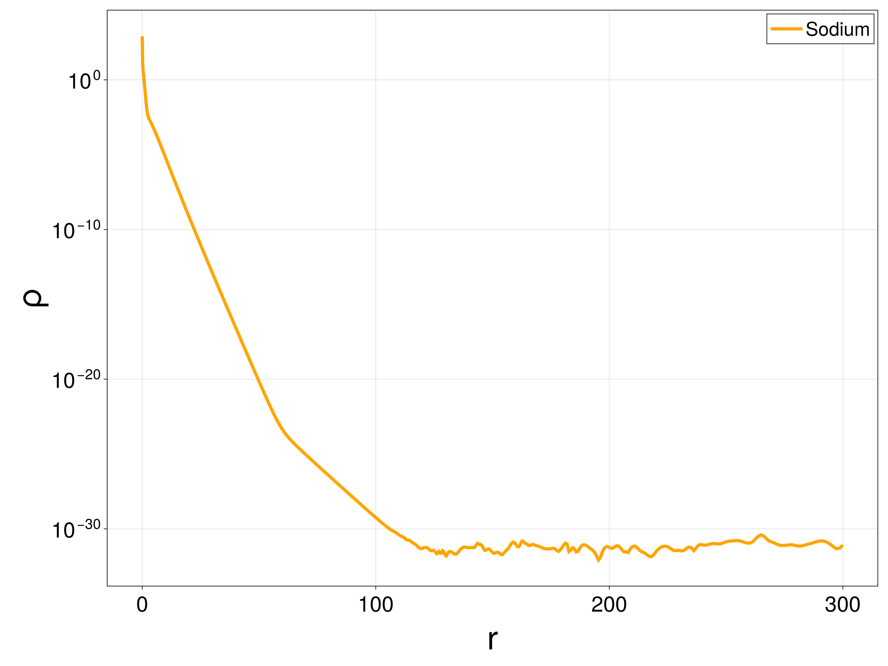
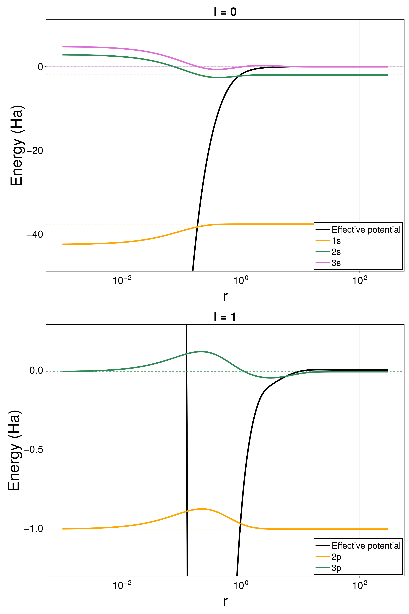
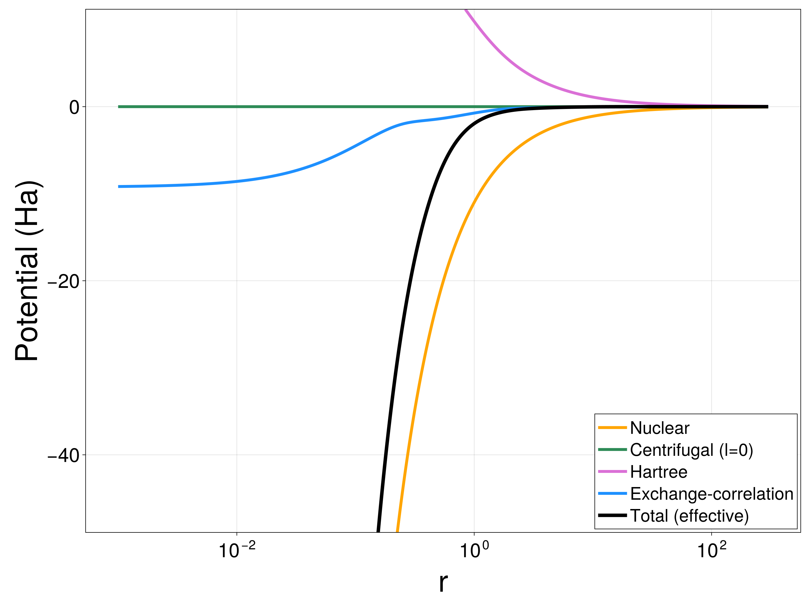
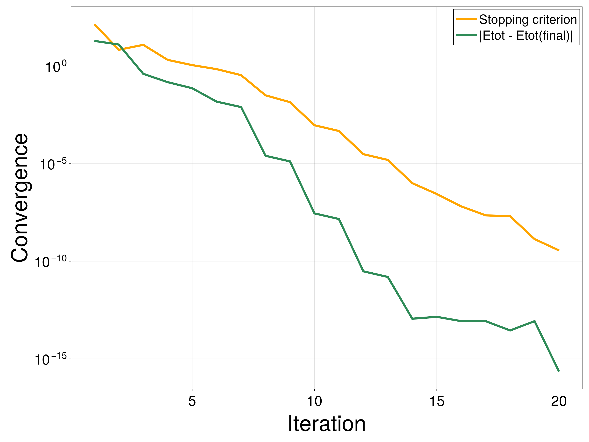
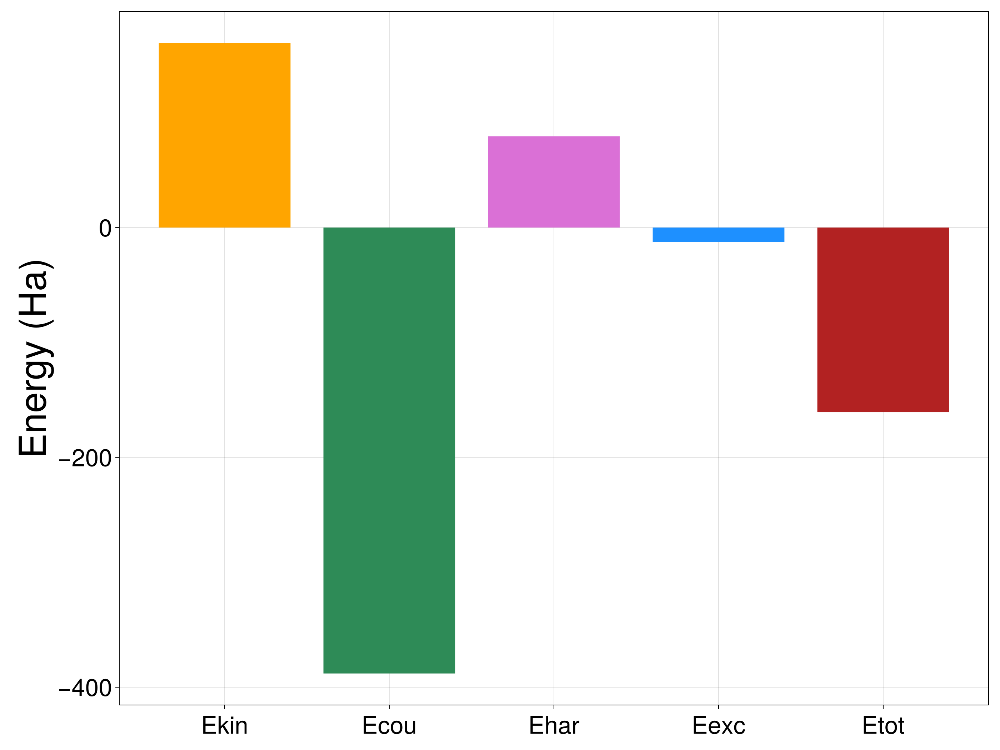

```@meta
CurrentModule = AtomicKohnSham
```

# Reports, logs & plots

Once a calculation has converged, three complementary outputs help you
inspect and archive it: a final text report, a per-iteration log, and
publication-style plots.

## Setup

This continues the running example (each manual page is self-contained, so
we solve it again here):

```@example manual
using AtomicKohnSham
using Libxc

model = KSEModel(Z = 11, N = 11, ex = Functional(:lda_x; n_spin = 1), ec = NoFunctional(1))
mesh = expmesh(0, 500, 60; s = 1.2)
basis = P1IntLegendreBasis(mesh; ordermax = 10)
discretization = KSEDiscretization(basis, model; lh = 2, nh = 10,
    fem_integration_method = GaussLegendre(basis, 2000))
alg = ODA(tinit = 0.6, aufbau = OptimizedAufbau(max_degen = 2, tol = 1e-1), scftol = 1e-9)

sol = groundstate(model, discretization, alg; maxiter = 100)
nothing # hide
```

## `results.txt`: a final report

```@docs
write_report
```

```@example manual
write_report(sol, "results.txt")
print(read("results.txt", String))
```

## `log.txt`: per-iteration diagnostics

Rather than a verbosity flag on the solver, per-iteration diagnostics are
written through the same [`CallbackSet`](@ref) mechanism used for any other
callback — so `log.txt` keeps being updated even if the SCF loop is later
interrupted or throws:

```@docs
CallbackSet
LogFileCallback
write_log_header
```

```@example manual
open("log.txt", "w") do io
    write_log_header(io, model, alg, discretization)
    groundstate(model, discretization, alg; maxiter = 100,
        callback = CallbackSet((LogFileCallback(io),)))
end

lines = split(read("log.txt", String), "\n")
println(join(lines[1:12], "\n"))     # header
println("[...]")
println(join(lines[end-4:end-1], "\n"))  # final iterations
```

## Plots

Plotting is a [package
extension](https://pkgdocs.julialang.org/v1/creating-packages/#Conditional-loading-of-code-in-packages-(package-extensions)):
the plotting functions become available as soon as `CairoMakie` is loaded
alongside `AtomicKohnSham`, with no extra setup:

```julia
using AtomicKohnSham, CairoMakie
```

```@docs
plot_density
plot_orbitals
plot_potentials
plot_convergence
plot_energy_breakdown
```

### Density

```julia
X = AtomicKohnSham.exprange(1e-3, 300, 2000; s = 1.5)
save("density.png", plot_density(sol, X))
```



### Orbitals

Each occupied orbital is drawn at its own energy, overlaid on the effective
potential of its angular momentum channel (one panel per `l`):

```julia
save("orbitals.png", plot_orbitals(sol, X))
```



### Potentials

```julia
save("potentials.png", plot_potentials(sol, X; l = 0))
```



### Convergence and energy breakdown

```julia
save("convergence.png", plot_convergence(sol))
save("energy_breakdown.png", plot_energy_breakdown(sol))
```




See the [API Reference](@ref) for the complete function index.
